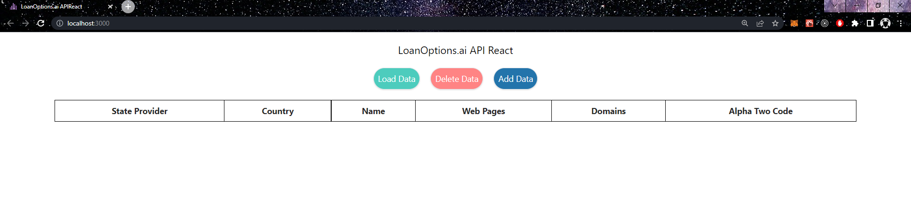
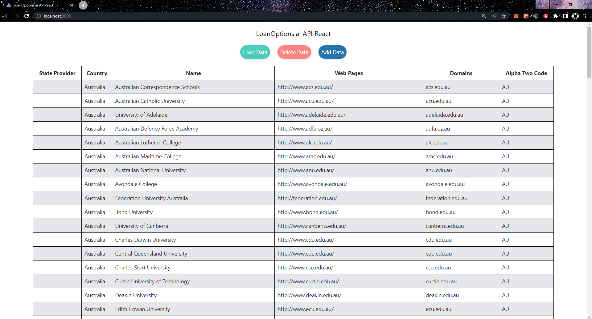
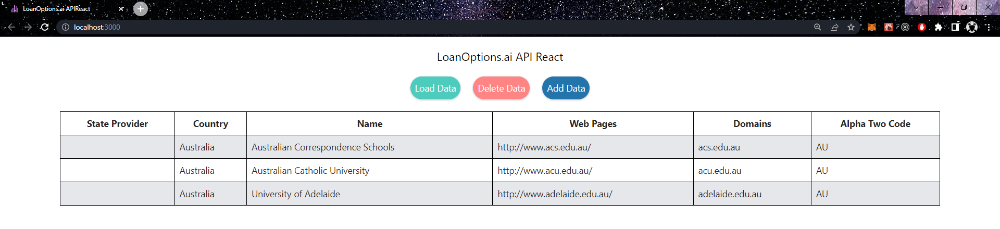
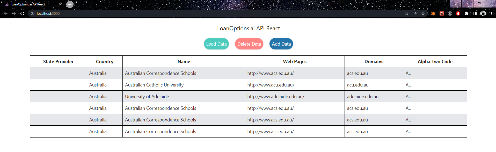

# LoanOptions.ai
### Assessment Task Part 1
##### By Nathan O'Donnell

### Task 1 - API | React
<b>Task:</b> Build a single page React application which fetches data from an API and displays the results on a table. It should have three buttons which LOAD, ADD and DELETE data.

##### Deployed Site
This application is served live at http://3.80.52.164:3000/ on an AWS EC2 instance.

##### Initial Page

##### After LOAD

##### After (multiple) DELETEs

##### After ADD

